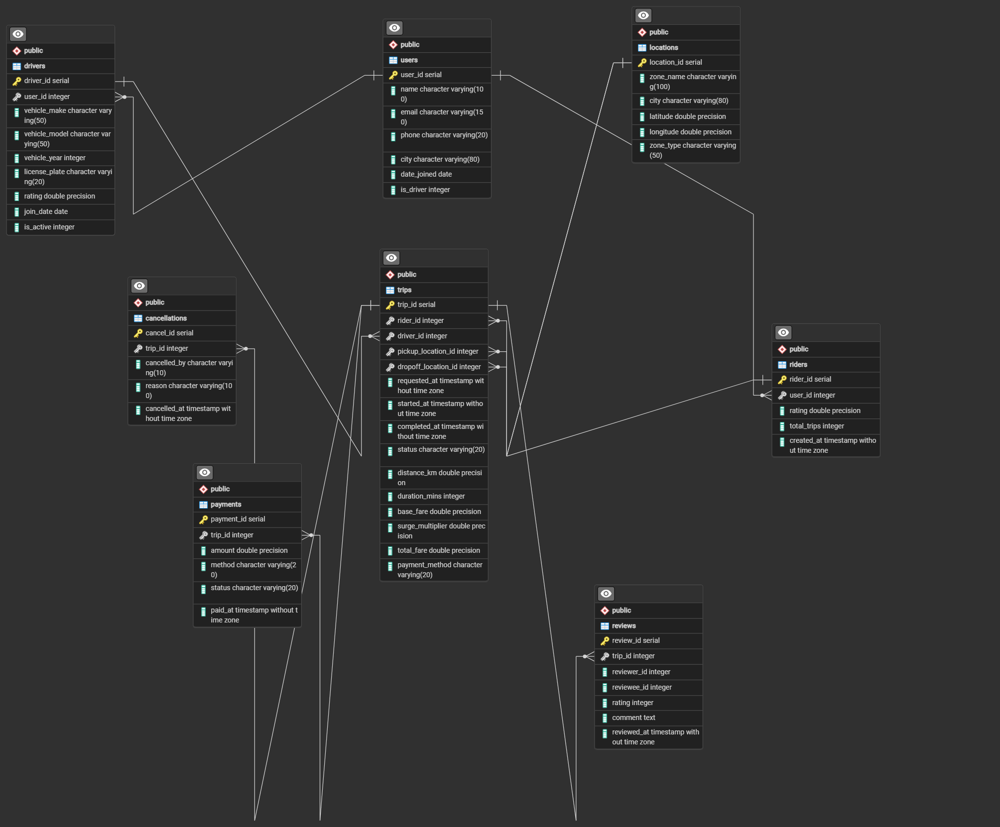

# Uber Marketplace SQL Analysis

## Overview
This project analyzes an Uber-style transportation dataset using SQL. The objective is to explore business performance across growth, revenue, rider activity, driver performance, and operational demand.

## Database Schema
The ERD below shows the relational structure used for the SQL analysis.

The database includes the following core entities:
- `users`: platform users and account information
- `drivers`: driver-specific attributes such as vehicle details and ratings
- `riders`: rider activity and profile metrics
- `trips`: trip-level operational and fare data
- `payments`: payment transaction details
- `reviews`: ratings and written feedback
- `cancellations`: cancelled trip records
- `locations`: pickup and dropoff zones

## Business Questions
- How is customer acquisition evolving month over month?
- Which cities generate the most riders and drivers?
- What is the total revenue and average fare per trip?
- Which payment methods are used most often?
- Who are the top-performing drivers?
- What share of drivers are inactive?
- Which riders are at risk of churning?
- Which pickup and dropoff zones are busiest?
- What are the most popular origin-destination pairs?

## SQL Skills Used
- CTEs
- Window functions
- Aggregations
- Joins
- Conditional logic
- Correlation analysis

## Project Files
- `Uber_anlysis.sql`: main analysis queries
- `DB_Stracture.png`: database schema image
- `README.md`: project presentation

## Potential Business Value
This project shows how SQL can be used to answer practical business questions in a ride-hailing marketplace, including:
- growth tracking
- revenue monitoring
- driver performance evaluation
- rider retention analysis
- operational hotspot detection
